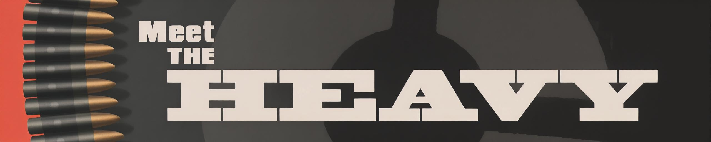
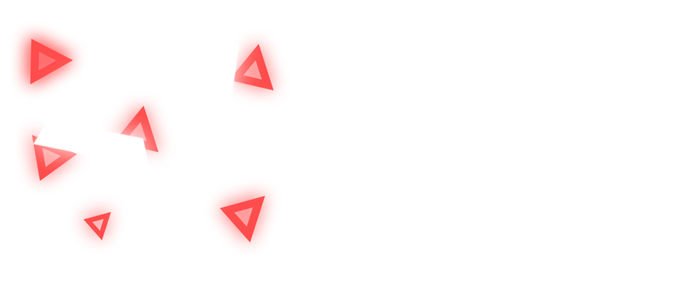

# Welcome to my Portfolio

Sup. I’m a **full-stack developer** with *half a decade* of experience (started in 2020, trust).

I build stuff, break stuff, fix stuff, automate stuff, and sometimes forget what I was fixing in the first place.

## About Me
- 💻 Full-stack: HTML / CSS / JS / Node.js / Python  
- 🐧 Linux enthusiast (Arch, Proxmox, TrueNAS)  
- 🪟 Windows survivor
---
## What I Do
- 🚀 Clean, fast websites  
- 🗄️ Deploy/manage VPS & servers  
- ☁️ Full self-hosted stacks  
- 🔧 Break at 3AM, fix at 3:01AM  
- 🫠 Automate everything because lazy
---
## Projects

**Fast-paced 2D shooter** 

[Play on itch.io](https://theveryheavy.itch.io/geomance)

---

## Contact Me
- 📧 Email: [contact@theveryheavy.eu](mailto:contact@theveryheavy.eu)  
- 💻 GitHub: [theveryheavy](https://github.com/theveryheavy)  

- 🌐 Personal site: [theveryheavy.eu](https://theveryheavy.eu)
